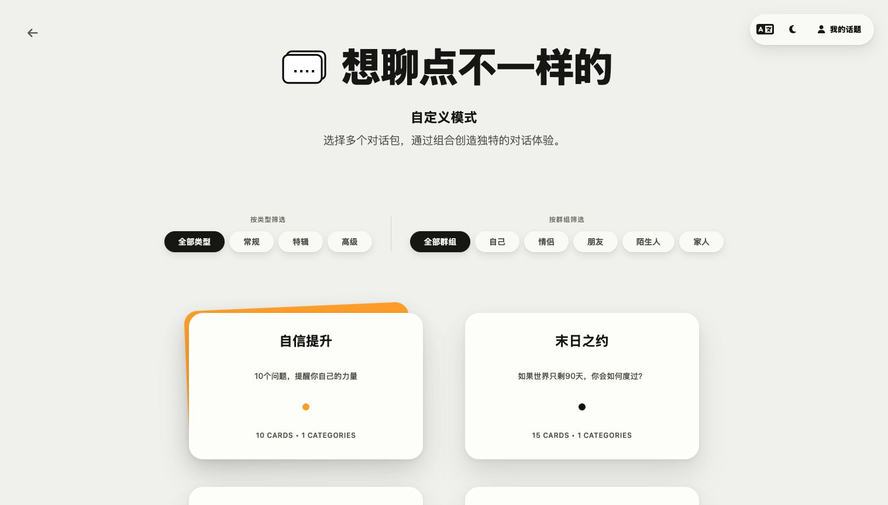
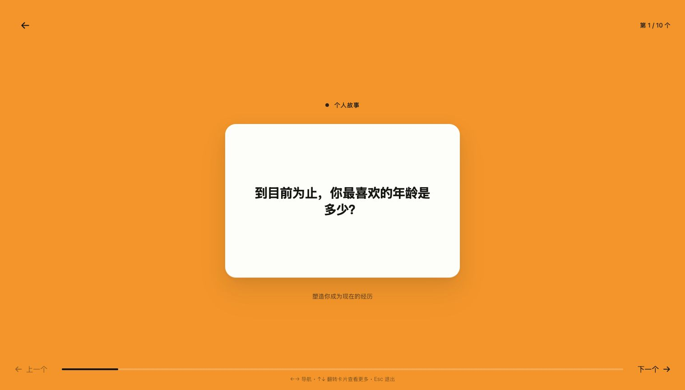
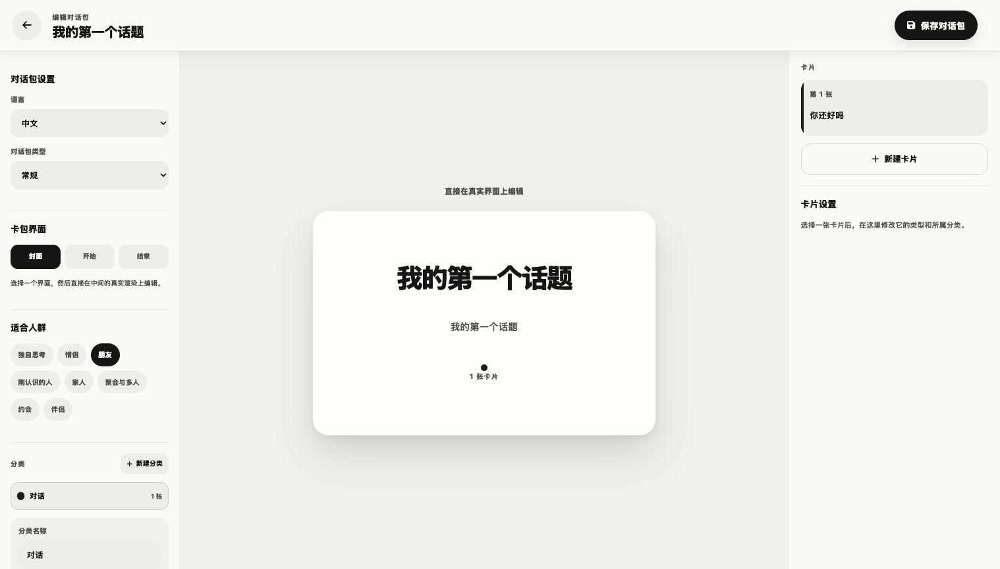

# FrankCards

<div align="center">


### 把难开口的话，变成可以一起翻开的卡片。

为伴侣、朋友、家人，以及刚刚认识的人准备的对话卡牌。

[在线使用](https://frank-cards.vercel.app/) · [下载 FrankCards v2.1.0](https://github.com/SonghaiFan/frank_cards/releases/tag/v2.1.0) · [查看全部版本](https://github.com/SonghaiFan/frank_cards/releases) · **中文** / [English](public/README-EN.md)

</div>


很多时候，我们不是没有话想说，只是不知道该从哪里开始。

FrankCards 把精心设计的问题放进一场有节奏的卡牌体验里。选一个适合此刻的对话包，把屏幕放在两个人中间，然后从第一张卡开始。没有标准答案，也没有输赢；真正重要的是接下来发生的对话。

## v2.1.0：温柔，也可以锋利

这一版重新写了全部 22 组中英文内置卡包，让它们共享一套更直接、更诚实的 FrankCards 语气。每张问题卡现在带有两种对话能量：圆润的 **Bouba** 让人慢慢打开，尖锐的 **Kiki** 则负责戳破客套和假装。真正有意义的对话不应该只有安全、正确、无关痛痒的问题。

自定义模式也加入了**官方 / 社区**两个空间。你可以创作、反复编辑自己的卡包；准备好后提交审核，通过的作品只会出现在自定义模式的社区中。管理员审核确保公开内容适合上架，同时保留创作者自己的声音。

## 它有什么不同 / What makes it different

|  |  |
| --- | --- |
| **不是问题清单，而是一场完整对话**<br>每个对话包都有自己的开场、分类、卡牌节奏与结束方式，让聊天自然地从轻松走向深入。 | **不是只能照着一副牌玩**<br>可以按关系、场景和当下的心情筛选内容，也可以把多个对话包自由组合成这一晚独有的一组牌。 |
| **不是填写表单来“配置内容”**<br>创建自己的话题时，直接在真实的封面和卡片上修改文字、背面提示、分类和颜色，看到的就是最终会使用的样子。 | **不是测验，也不替你分析关系**<br>FrankCards 不打分、不下结论。它只是给出一个足够好的问题，把注意力还给坐在你面前的人。 |

## 为不同的关系，留一点真正聊天的空间

- 刚认识时，跳过重复的寒暄，找到彼此真正好奇的地方。
- 和伴侣定期聊聊最近的感受、期待与没有说出口的小事。
- 在朋友聚会里，从轻松好笑的问题慢慢走向更真实的分享。
- 和家人谈谈成长、记忆与那些平时很少被问起的经历。
- 一个人使用，把问题当作自我整理和书写的起点。

## 选择适合此刻的对话

内置对话包覆盖关系签到、个人故事、异地恋、朋友、家庭、自我关爱、脑洞问题等不同方向。想随手开始，可以直接选一副；想让对话更贴近在场的人，也可以按类型和适合人群自由组合。



## 卡片只负责提问，空间留给你们

一次只出现一个问题。卡片的颜色、分类、正反面和进度帮助对话保持节奏，但不会抢走注意力。你们可以停留、翻面、继续下一张，也可以在某一个问题上聊很久。

<table>
  <tr>
    <td width="50%"></td>
    <td width="50%"></td>
  </tr>
  <tr>
    <td align="center"><sub>让问题安静地待在中间，而不是塞满整个界面。</sub></td>
    <td align="center"><sub>直接在真实卡片上创作自己的对话包。</sub></td>
  </tr>
</table>

## 也可以写下你自己的问题

有些对话只属于某段关系、某次旅行或某一个晚上。登录后，你可以创建自己的对话包，编辑封面、开始与结束界面，为问题添加背面提示，并用分类和颜色整理节奏。保存后仍然可以继续修改，或直接拿来使用。

新卡包默认只属于你。想分享给其他人时，可以提交给管理员审核；通过后，它只会出现在自定义模式的**社区**中，不会混入 FrankCards 官方卡包。已发布卡包仍可编辑，修改后会重新进入审核。

内置对话包无需登录即可使用；用户创建的话题会保存在自己的账号中。v2.1.0 也补全了邮箱验证、忘记密码与更清楚的垃圾邮件提示，并优化了移动端悬浮进度点与切换动画。

## 下载

当前版本提供：

- macOS — Apple Silicon 与 Intel
- Windows — `.exe` 与 `.msi`

前往 [FrankCards v2.1.0 Release](https://github.com/SonghaiFan/frank_cards/releases/tag/v2.1.0) 下载适合你的版本。

> macOS 版本目前尚未进行 Apple notarization，首次打开时系统可能显示安全提醒。

<details>
<summary><strong>想运行代码或参与开发？</strong></summary>

### 本地运行

需要 Node.js 20+ 与 npm：

```bash
git clone https://github.com/SonghaiFan/frank_cards.git
cd frank_cards
npm ci
npm run dev
```

桌面端使用 Tauri 2；安装 Rust 与 Tauri prerequisites 后运行：

```bash
npm run tauri dev
```

用户账号和自定义话题由 Supabase 提供。相关环境变量、数据库迁移和邮件配置见 [Supabase 说明](supabase/README.md)。项目使用 React、TypeScript、Vite、Supabase 与 Tauri，并以 [MIT License](LICENSE) 开源。

欢迎提交 Issue 或 Pull Request；参与前可以阅读 [贡献指南](CONTRIBUTING_GUIDE.md)。

</details>

<div align="center">

**Made for conversations that matter.**

</div>
