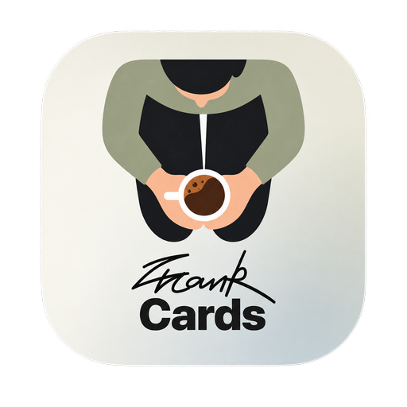

# FrankCards

<div align="center">



### Turn hard-to-start conversations into cards you can open together.

Conversation cards for partners, friends, families, and people who have only just met.

[Use online](https://frank-cards.vercel.app/) · [Download v2.1.0](https://github.com/SonghaiFan/frank_cards/releases/tag/v2.1.0) · [All releases](https://github.com/SonghaiFan/frank_cards/releases) · [中文](../README.md) / **English**

</div>


FrankCards turns hard-to-ask questions into a paced, shared card experience. Pick a pack that fits the moment, place the screen between you, and begin with the first card. There are no correct answers, scores, or relationship diagnoses. The conversation that follows is the point.

## What makes it different

- **One pack is a complete conversation:** each pack has an opening, categories, card backs, and an ending, so the exchange can move naturally from light to meaningful.
- **Questions carry different energies:** rounded **Bouba** cards help people open up, while pointed **Kiki** cards cut through politeness and performance.
- **You are not limited to a fixed deck:** 22 built-in packs in English and Chinese cover partners, friends, family, self-reflection, and different situations. Filter and combine them into a set for this particular evening.
- **Create on the real cards:** edit the cover, questions, card backs, categories, and colors directly. What you see is what people will use, without a separate configuration form.


## Create your own conversation pack

Built-in packs work without an account. After signing in, create a private pack, return to edit it, or use it immediately. When you want to share it, submit it for review. Approved work appears only in **Community** inside Custom Mode and never mixes with official FrankCards content. Published packs remain editable, with updates returning to review.

<table>
  <tr>
    <td width="50%"></td>
    <td width="50%"></td>
  </tr>
  <tr>
    <td align="center"><sub>One question stays quietly in the middle.</sub></td>
    <td align="center"><sub>Create directly on the cards people will use.</sub></td>
  </tr>
</table>

## Download

v2.1.0 includes installers for macOS (Apple Silicon and Intel) and Windows (`.exe` and `.msi`). Download the right build from the [release page](https://github.com/SonghaiFan/frank_cards/releases/tag/v2.1.0).

> The macOS build is not yet notarized by Apple, so macOS may show a security prompt the first time it opens.

<details>
<summary><strong>Run locally or contribute</strong></summary>

With Node.js 20+ and npm installed:

```bash
git clone https://github.com/SonghaiFan/frank_cards.git
cd frank_cards
npm ci
npm run dev
```

The desktop app uses Tauri 2. After installing Rust and the Tauri prerequisites:

```bash
npm run tauri dev
```

Accounts and user-created topics use Supabase; setup is documented in the [Supabase guide](../supabase/README.md). FrankCards uses React, TypeScript, Vite, Supabase, and Tauri, and is released under the [MIT License](../LICENSE). Read the [contribution guide](../CONTRIBUTING_GUIDE.md) before getting started.

</details>

<div align="center">

**Made for conversations that matter.**

</div>
